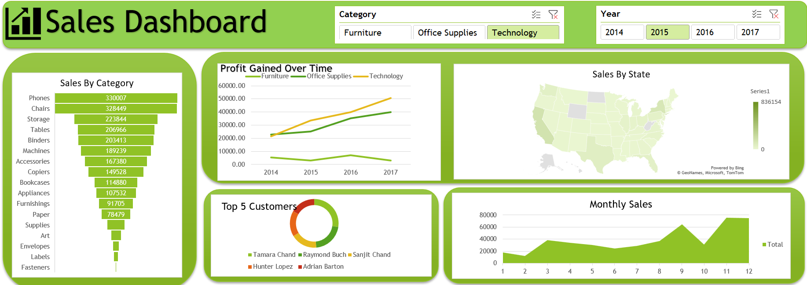

# 📊 Sales Dashboard — Excel Practice Project

## 📌 Project Overview

This is an Excel-based Sales Dashboard created as a practice project to strengthen my skills in data cleaning, data analysis, and business dashboard development.

The project uses the Sample Superstore dataset and transforms the raw data into an interactive dashboard using Microsoft Excel.

## 🛠️ Tools & Techniques Used

- Microsoft Excel
- Data Cleaning
- Data Formatting
- PivotTables
- PivotCharts
- Slicers
- Data Analysis
- Dashboard Design

## 🧹 Data Preparation

The raw dataset was cleaned and prepared directly in Excel before performing the analysis.

The preparation process included:

- Checking and cleaning the dataset
- Removing duplicate records where required
- Handling missing or inconsistent values
- Standardizing data formats
- Preparing the data for PivotTable-based analysis

## 📈 Dashboard Analysis

The dashboard provides insights into:

- Sales by Category
- Monthly Sales Performance
- Profit Trend Over Time
- Sales by State
- Top 5 Customers
- Category-wise Performance
- Year-wise Analysis

Interactive slicers are included to filter the dashboard by:

- Category
- Year

## 🎯 Project Objective

The main objective of this project was to practice the complete Excel analytics workflow:

**Data Cleaning → Data Analysis → Visualization → Interactive Dashboard**

This project helped me improve my understanding of using Excel to convert raw business data into meaningful visual insights.

## 🖼️ Dashboard Preview

## 📁 Project Files

- `Sample - Superstore.xlsx` — Complete Excel workbook containing the cleaned data, analysis, PivotTables, PivotCharts, slicers, and dashboard.
- `Screenshots/` — Dashboard preview image.

## 📚 Project Type

**Practice Project | Data Analytics | Microsoft Excel**
